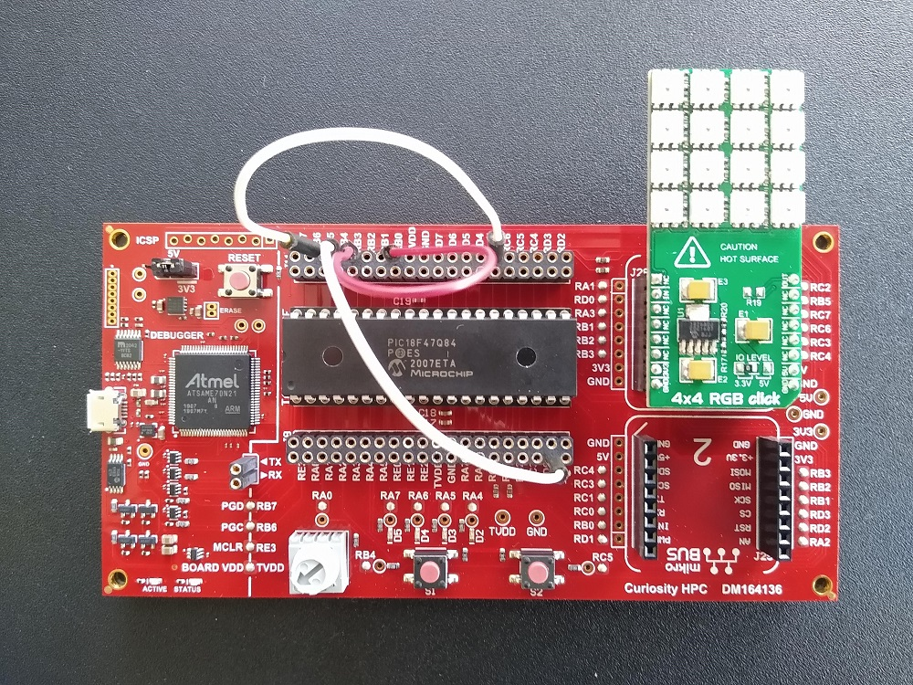
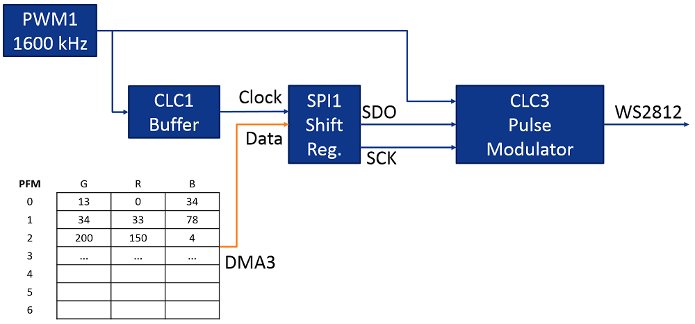
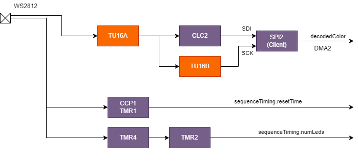
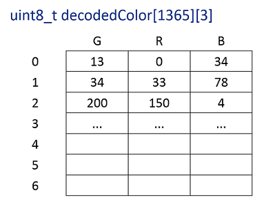
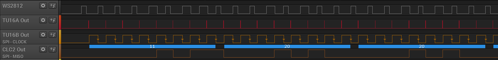
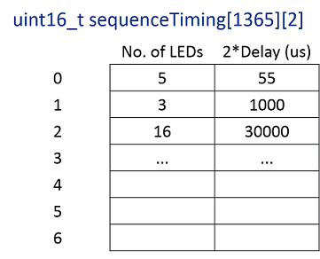
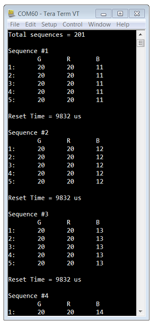
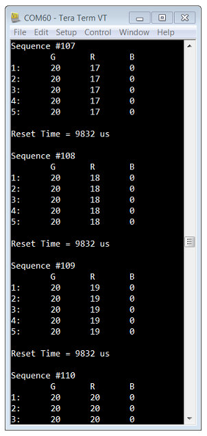
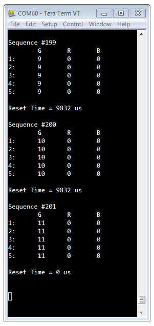

## Decoding WS2812 Datastream using UTMR, SPI and Other CIPs

This demo is based on the PIC18F47Q84 Curiosity HPC platform which illustrates how a pulse-width modulated WS2812 signal can be decoded using the new Universal Timer (UTMR) module along with other PIC® Core Independent Peripherals (CIPs) like SPI, CLC, and CCP. This demo also shows an example of generating WS2812 signal using the new 16-bit PWM module, SPI, and CLC.

## Related Documentation

- Using the Universal Timer (UTMR) Module (TB3264)
- Using the New Universal Timer (UTMR) Module as Legacy PIC16/PIC18 Timers (TBXXXX)
- Using the Configurable Logic Cell (CLC) to Interface a PIC16F1509 and WS2811 LED Driver [(AN1606)](https://www.microchip.com/wwwAppNotes/AppNotes.aspx?appnote=en567146 "(AN1606)")
- How To Use Neopixels With PIC® Microcontrollers [(YouTube)](https://youtu.be/hHLMnJs87VE "(YouTube)")

## Software Used

- MPLAB® X IDE 5.40 or newer [(microchip.com/mplab/mplab-x-ide)](http://www.microchip.com/mplab/mplab-x-ide)
- MPLAB® XC8 2.20 or a newer compiler [(microchip.com/mplab/compilers)](http://www.microchip.com/mplab/compilers)
- MPLAB® Code Configurator (MCC) 3.95.0 or newer [(microchip.com/mplab/mplab-code-configurator)](https://www.microchip.com/mplab/mplab-code-configurator)
- MPLAB® Code Configurator (MCC) Device Libraries PIC10 / PIC12 / PIC16 / PIC18 MCUs (1.81.3) or newer [(microchip.com/mplab/mplab-code-configurator)](https://www.microchip.com/mplab/mplab-code-configurator)
- Microchip PIC18F-Q Series Device Support (1.7.135) or newer [(packs.download.microchip.com/)](https://packs.download.microchip.com/) 

## Hardware Used

- PIC18F47Q84 [(40-pin PDIP)](https://www.microchip.com/wwwproducts/en/PIC18F47Q84 "(PIC18F47Q84)")
- Curiosity High Pin Count (HPC) Development Board [(DM164136)](https://www.microchip.com/Developmenttools/ProductDetails/DM164136 "(DM164136)")
- 4x4 RGB Click [(MIKROE-1881)](https://www.mikroe.com/4x4-rgb-click "(MIKROE-1881)")

## Hardware Setup

- The 4x4 RGB Click is connected through Click 1 Expansion Header on the Curiosity HPC board.
- WS2812 output is via RD0 pin to the RGB Click.
- Pins RD0 (WS2812 datastream) and RB4 (CLC2IN/CCP1IN/TUIN1) are shorted to feed the WS2812 input to the decoder.
- Pins RC7 (CLC2 SPI-compatible output) and RB5 (SPI2SDI input) are shorted.
- Pins RB0 (TU16B output) and RB3 (SPI2SCK input) are shorted.

For details of pin connections, refer to "WS2812 Datastream Decoding" section below.

## Software Setup

MCC is used to configure the following. Refer to the MPLAB X project for details and settings for each component.

### WS2812 Datastream Generation

- TMR0 - generates 10 ms reset time for WS2812 signal
- PWM1_16BIT - generates time base for SPI1 and also used in CLC3 as a pulse modulator signal
- CLC1 - buffer to feed PWM1 as clock to SPI1
- SPI1 - operates as an output shift register in master mode to serialize RGB data
- CLC3 - pulse modulator generating WS2812 datastream
- DMA3 - transfers RGB data from PFM to SPI1 when started from TMR0 ISR

Refer to "How To Use Neopixels With PIC® Microcontrollers" [(YouTube)](https://youtu.be/hHLMnJs87VE "(YouTube)") to understand how WS2812 datastream is generated using the 16-bit PWM, SPI, and CLC.

### WS2812 Datastream Decoding

- TU16A (UTMR) - pulse differentiator to distinguish between short and long pulses of WS2812
- TU16B (UTMR) - triggered by TU16A_OUT, generates clock for SPI2 in sync with CLC2 output
- CLC2 - generates SPI compatible signal based on WS2812 input and TU16A periodic pulse output
- SPI2 - operates as an input shift register in slave mode
- DMA2 - stores output of SPI2 (decoded color) into RAM
- CCP1 - captures low level reset time in between WS2812 packets
- TMR1 - generates time base for CCP1
- UART5 - used for printing datastream

#### TU16A and CLC2 Setup as Pulse Differentiator

The TU16A UTMR can be combined with a D Flip Flop in a CLC peripheral to differentiate between long and short pulse widths as shown in the diagram below.

TU16A Settings:
- START = Rising ERS Edge
- RESET = At Start + PR Match
- STOP = At PR Match
- ERS = WS2812 input through TUIN1PPS
- Clock = Fosc (64 MHz) with Prescaler = 0 (1:1)
- Synchronization = Enabled
- Output = Pulse mode
- Period Count = 30 (selected to be a number to differentiate between short and long pulse widths)

The UTMR resets to zero and starts counting as soon as it sees a rising edge of the WS2812 input signal. It counts until a period match occurs. At PR match, the UTMR resets and stops counting, and generates a pulse output. This pulse output acts as a clock trigger of a D Flip Flop in CLC2 which samples the state of the WS2812 input. If the WS2812 pulse is shorter than the PR match period, then the CLC will sample a low signal. If the WS2812 pulse is longer than the PR match period, the CLC will sample a high pulse. The output of the CLC2 is a SPI-compatible signal which goes in as SDI signal for SPI2.

#### TU16B Setup as SPI Clock Generation

The combination of TU16A and CLC2 generates a SPI-compatible signal that will be shifted in by SPI2 (described in section below). TU16B UTMR is used to generate a clock for SPI2 that in sync with the SDI signal. The level output mode of UTMR is leveraged to create a pulse-width-controlled clock signal.

TU16B Settings:
- START = Rising ERS Edge
- RESET = At Start + PR Match
- STOP = At PR Match
- ERS = TU16A_OUT
- Clock = Fosc (64 MHz) with Prescaler = 0 (1:1)
- Synchronization = Enabled
- Output = Level mode
- Period Count = 40 (selected to be at 50% duty cycle of WS2812 frequency)

To ensure that the TU16B output is in sync with the SDI data input, the TU16B is triggered to start when TU16A pulse output occurs (see ERS setting). At every rising edge of TU16A pulse output, TU16B resets and starts counting until PR match. While the timer is in "Run" state, the TU16B Level output is high. When TU16B stops at PR match, the TU16B Level output goes low as well. This TU16B level output is used as the SCK input clock for SPI2.

#### SPI2 and DMA2 Setup as Input Shift Register

SPI2 is configured to operate in Slave receive-only mode. The output of the pulse differentiator from CLC2 is fed in as the input data (SDI) and the output of the TU16B UTMR is fed in as the input slave clock (SCK). As the SPI continues to receive messages, it triggers DMA2 to transfer the decoded color values into decodedColor array in the RAM.

The SPI2RX interrupt is enabled. The ISR is triggered upon a successful reception of a byte. A small code is written inside this ISR to keep track of LED counts (every 3 bytes received = 1 LED GRB value). After each LED value (3 bytes) is received, the CCP1 is enabled to measure the reset time (described below).

The waveform below shows the different signals discussed above.

#### CCP1 and TMR1 Setup to Detect Sequence Timing

The CCP1 module is used to capture the reset time of the WS2812 signal to detect the entire sequence.

CCP1 Settings:
- Base Timer = TMR1
- Input Signal = WS2812 input through CCP1 pin
- Mode = Capture on every Rising edge
- Interrupt = Enabled

TMR1 Settings:
- Clock Source = Fosc/4 with Prescaler = 1:8
- Synchronization = Enabled
- 16-bit read = Enabled
- Gate = Disabled
- Period Count = 0 (allows for maximum period value of 32.768 ms at natural rollover)

The above setting allows the CCP to capture low pulse times. In the CCP1 ISR, if the low pulse time is greater than 50 us, it qualifies as a valid reset time for WS2812 signal. If the low pulse time is less than 50 us, the captured value is discarded. TMR1IF flag is also checked for TMR1 overflows (which also qualifies as a valid reset time). This data is compiled and stored in the sequenceTiming array to be used by a parser to print the datastream sequence through UART5.

## Operation

Steps to run the application:
- As soon as the board powers up, WS2812 generation begins and the 4x4 RGB Click will start to light up and display patterns.
- Press S2 switch on the board to begin data acquisition. The software starts to capture and process WS2812 datastream as it arrives. The capture stops after 2 seconds or when it runs out of memory (1365 LED color values, 4095 bytes), whichever occurs first.
- The datastream is printed via UART5 on to the terminal.
- Press S2 switch again to begin another acquisition.

## Summary

The new UTMR can be configured to operate as a pulse differentiator, which can be used to decode a pulse-width modulated signal such as WS2812 datastream.